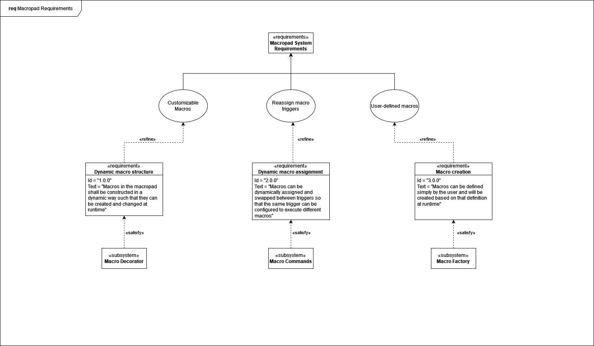

# Macropad Design Pattern Example

## Overview

Simple configurable macropad program to demonstrate a couple of design patterns. This software does not actually execute macros on the system, rather it uses the included Keyboard class as a placeholder that prints any state changes.

### Usage

Simply run:

```shell
python macropad.py <macro definition path> <macro definition path> ...
```

You may specify any number of definition paths, or none, which will load the two included examples.

The program will prompt for input. Sending an integer to the program will cause the macro with the corresponding index to be executed. Two layers of macros are defined in the `setup` function, which can be toggled between by sending `switch`. Sending `quit` will close the program.

### Configuration

Macros can be easily configured using an xml-like structure. Refer to the included xml files for more info.

## Class Diagram


## Requirement Diagram



## Other notes

Q. Why did I implement my own XML parser instead of using a built-in library?

A. Because I felt like having some fun

Q. Is this a real macropad?

A. No. As I said above, this does not actually execute anything, and just prints the keyboard actions to the console.