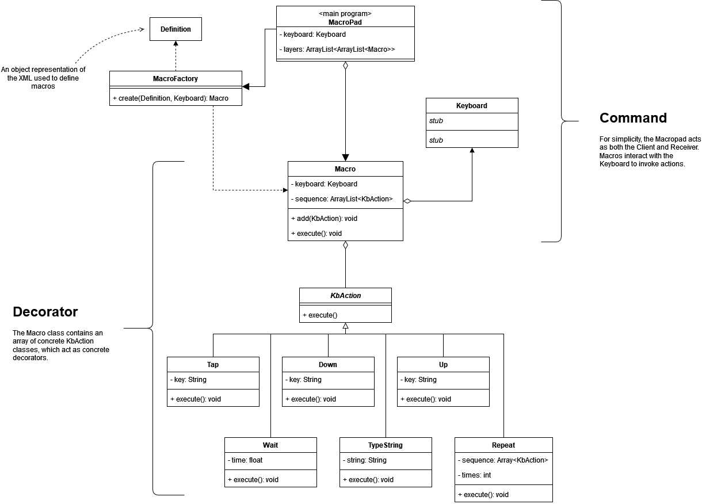

# Macropad Design Pattern Example

## Overview

Simple configurable macropad program to demonstrate a couple of design patterns. The Keyboard class is a placeholder to represent a software keyboard that can set the state of keys.

## Diagram

